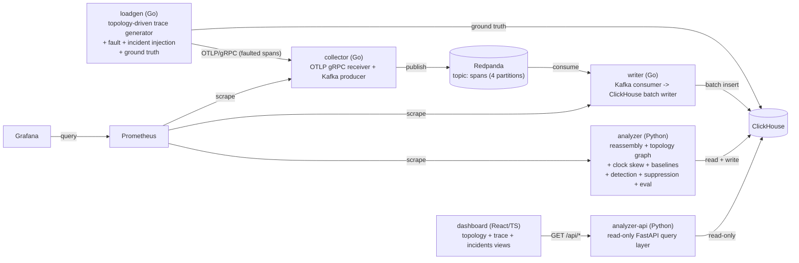

# Distributed Tracing Platform

An end-to-end distributed tracing pipeline I built from scratch: an OTLP
ingest path, a Kafka-backed writer into ClickHouse, a Python analyzer
that reassembles traces into a service topology, detects clock skew,
models rolling baselines, and raises (and suppresses) anomaly incidents
— plus a synthetic load generator that ships its own ground truth, so
every stage's output can be scored against what was actually true
rather than eyeballed. A read-only query API and a small React dashboard
sit on top, for looking at any of it without a ClickHouse client.

This isn't a wrapper around an existing tracing backend (Jaeger,
Tempo). Every stage — ingest, storage, reassembly, topology, clock skew
estimation, baseline modeling, anomaly detection, alert suppression,
and accuracy evaluation — is implemented here, specifically so its
correctness could be measured against ground truth rather than assumed.

## What it actually does

1. **`loadgen`** walks a YAML-defined service topology and generates
   synthetic traces, independently injecting two different kinds of
   imperfection: *faults* (dropped spans, out-of-order/late delivery,
   clock skew — things that corrupt the *observability pipeline's*
   picture of a healthy system) and *incidents* (latency spikes,
   error bursts, throughput drops — things where the simulated system
   itself actually misbehaved). Both are logged to ground-truth tables
   before anything else touches the trace, so later stages can be
   scored against what was *actually* generated, not what merely
   arrived.
2. **`collector`** receives OTLP/gRPC and publishes to Kafka
   (Redpanda); **`writer`** consumes and batch-inserts into
   ClickHouse, with commit-on-success semantics so a ClickHouse outage
   backs up instead of losing data (verified directly — see
   `docs/BENCHMARKS.md`).
3. **`analyzer`** runs a windowed poll loop over ClickHouse and, per
   window: reassembles traces (classifying every span as attached,
   orphaned, or cyclic — never silently reparented), aggregates the
   service topology graph, estimates per-service clock offsets,
   maintains rolling per-service/per-edge baselines, runs three
   independent anomaly detectors against those baselines, and groups +
   suppresses the resulting detections into incidents (so a real
   downstream failure doesn't also read as five separate upstream
   "incidents" echoing the same root cause).
4. **`analyzer-api`** is a read-only FastAPI layer over the same
   ClickHouse tables, and **`dashboard`** is a React/TypeScript
   frontend on top of that — a service topology graph, a per-trace
   flame graph, and an incidents list. See `docs/ARCHITECTURE.md`'s
   "Dashboard" section for what each view actually shows and why.
5. **`eval.py`** compares steps 3's output against step 1's ground
   truth for a given run: edge/span reconstruction accuracy, clock
   offset error, and incident detection precision/recall/latency/
   root-cause accuracy. This is the harness behind every number in
   `docs/BENCHMARKS.md` — nothing in this README or that file is
   invented or estimated.

## Architecture



Full component-by-component detail, including every table's schema
reasoning, the windowing/watermark model, and each detector's
statistics, is in `docs/ARCHITECTURE.md`.

## Running it

Everything below needs Docker with the compose plugin.

```sh
cd deploy
docker compose up --build
```

Brings up Redpanda, ClickHouse, collector, writer, analyzer,
analyzer-api, Prometheus, and Grafana (`http://localhost:3000`,
anonymous viewer access for local dev). The query API is at
`http://localhost:8000`; every endpoint requires an explicit `start`/
`end`:

```sh
curl 'http://localhost:8000/api/topology?start=2026-01-01T00:00:00Z&end=2026-01-01T01:00:00Z'
```

```sh
cd dashboard
npm install
npm run dev
```

Serves the dashboard at `http://localhost:5173` (needs the compose
stack already running). `npm test` runs the frontend test suite;
`npm run build` produces a production bundle.

```sh
cd loadgen
go run ./cmd/loadgen --target localhost:4317 --clickhouse-addr localhost:9000 \
  --clickhouse-password tracing-dev --rate 5 --duration 30s
```

Sends synthetic traffic and records ground truth for it. Add
`--drop-rate 0.1`, `--clock-skew-rate 0.25`, etc. for faults, or
`--incident-type latency_spike --incident-target-service checkout
--incident-magnitude 5 --incident-start 30s --incident-duration 60s`
for an incident. Once a run's traffic has cleared the analyzer's
watermark:

```sh
cd analyzer
python -m analyzer.eval <run_id>          # human summary
python -m analyzer.eval <run_id> --json   # machine-readable
```

Test suites: `cd analyzer && python -m pytest` (Python, fast, CI);
`cd integration && go test -tags=integration ./...` (full compose-based
pipeline test, not in CI — needs Docker); `cd dashboard && npm test`
(frontend). Full instructions, including the fault/incident sweep
scripts used to produce every number below, are in
`docs/ARCHITECTURE.md`'s "Running locally" section.

## Results

Every number below is measured, from `docs/BENCHMARKS.md`, which has
the full tables and methodology. Nothing here is estimated or
invented.

- **Trace reconstruction is accurate at a ~99.9% baseline floor**
  (traces straddling an analyzer window boundary are the only source
  of "incompleteness" at 0% fault rate — an inherent cost of
  windowed-batch processing, not a bug), degrading predictably as
  drop/reorder/late-arrival fault rates increase — see
  `docs/BENCHMARKS.md`'s Phase 1-2 tables for the full sweep.
- **Incident detection precision/recall**, aggregated across the
  21-point non-control incident sweep: 44 found, 18 true positives
  (0.409 aggregate precision) after fixing an evaluation-scoping bug
  that had inflated the "found" count with process-boundary noise —
  see `docs/ISSUES.md` for the fix and `docs/BENCHMARKS.md` for the
  per-incident-type breakdown, including the self-time dilution effect
  that makes a non-leaf service's incidents systematically harder to
  detect than a leaf's.
- **Root-cause accuracy on suppressed/derived incidents: 53/53 = 1.0**
  — every derived incident whose window overlapped a true incident
  correctly named that incident's real target, including a three-hop
  propagation chain resolved through an intermediate hop.
- **Detection latency: 0.8s-22.1s (mean 12.0s, median 12.2s, n=18)** —
  after fixing a reference-point bug that had silently floored 21 of
  22 measurements to 0.0s. A mean close to half the analyzer's window
  width is the expected result of incidents starting at an essentially
  random offset within their first window, not a claim about "true"
  reaction speed (watermark/poll delay isn't included — see
  `docs/BENCHMARKS.md`).
- **Dashboard API latency** (single-request, not load-tested — see
  Known limitations): 4-80ms across all five endpoints against this
  project's current data volume, `/api/traces` being the slower
  outlier because of its Python-side duration-filter compromise (see
  below).

## Known limitations

Stated plainly, not smoothed over — each of these is a real, measured
finding, not a hypothetical:

- **Healthy-control false-positive rate is not good.** Over one 180s
  run with zero injected incidents: **949.6 detections/hour** measured
  over the full evaluated range (including the harness's own inter-run
  silence), or **282.9/hour** measured strictly within the run's own
  active window. Every single one of these is a `call_rate` detection
  triggered by a finite load generator process ramping traffic up and
  down at its own start/end — not a detector malfunction, but a real
  artifact of how this project's test harness generates traffic that
  would need a different harness shape (or explicit boundary-window
  exclusion) to measure past. See `docs/BENCHMARKS.md`'s
  "Healthy-control false positives" section for the full mechanism.
- **Clock offset estimation has a ~13-51ms structural noise floor.**
  At clock-skew rates where no service actually got skewed, the
  estimator still consistently reports 12.76-13.02ms of "drift" for
  one service and 51.15-51.58ms for two others, across independent
  runs — the estimator's baseline can't distinguish genuine clock skew
  from ordinary inter-service latency that happens to differ by edge.
  When a service is skewed by an amount well past that floor (tested
  at -1,712.68ms), it's recovered with zero error — this is a
  small-skew detection limit, not a general failure of the method. See
  `docs/BENCHMARKS.md`'s Phase 2 clock offset section.
- **Incident magnitude isn't uniformly comparable across the call
  tree.** A span's recorded duration already includes its children's,
  so a `latency_spike` on a non-leaf service inflates only its own
  processing-time component — the same nominal 5x magnitude produced a
  clean ~5-6x p99 shift on a leaf service but only a ~2x shift
  (barely crossing the detection threshold) on a hub service whose
  baseline duration was mostly downstream latency to begin with. See
  `docs/ISSUES.md`.
- **`GET /api/traces`' `min_duration_ms` filter can silently miss
  matches under high trace volume** — it's applied in Python over a
  capped candidate set, not in SQL, because trace duration isn't
  stored anywhere Phases 1-3 already write. The response's
  `duration_filter_truncated` flag is set whenever this actually
  happens (confirmed live to fire at this project's real sweep
  traffic volumes) so a caller knows the result may be incomplete
  rather than assuming it's exhaustive. See `docs/DECISIONS.md`.
- **The dashboard's empty incidents state is honestly ambiguous.** An
  empty incident list can't distinguish "the system is healthy" from
  "baselines are still warming up" without new backend detection logic
  this phase doesn't add — the UI says so directly rather than
  implying health. See `docs/ARCHITECTURE.md`'s "Dashboard" section.
- **No load testing has been done.** Every latency number in this
  README and in `docs/BENCHMARKS.md`'s Phase 4 section is a
  single-client, single-request measurement against this project's
  current (modest) data volume — sustained-throughput and
  concurrent-load characterization is Phase 6, not yet built.
- **The dashboard was not visually verified in a browser during
  development** — every response shape was checked against the
  frontend's TypeScript types directly against the live API, and every
  component's rendering logic (orphan nesting, derived-incident
  styling, empty/error states) is covered by `npm test`, but no
  screenshot or interactive click-through exists confirming the
  rendered result looks right.

Full reasoning behind every non-obvious decision (not just the ones
above) is in `docs/DECISIONS.md`; every bug actually hit during
development, with symptom → root cause → fix, is in `docs/ISSUES.md`.
