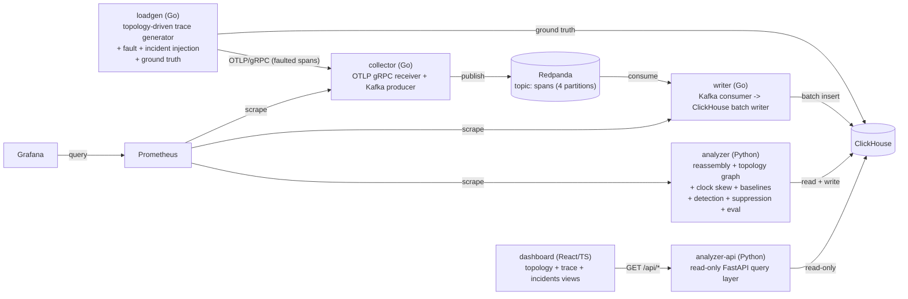

# Distributed Tracing Platform

An end-to-end distributed tracing pipeline I built from scratch: an OTLP
ingest path, a Kafka-backed writer into ClickHouse, a Python analyzer
that reassembles traces into a service topology, detects clock skew,
models rolling baselines, and raises (and suppresses) anomaly incidents
— plus a synthetic load generator that ships its own ground truth, so
every stage's output can be scored against what was actually true
rather than eyeballed. A read-only query API and a small React dashboard
sit on top, for looking at any of it without a ClickHouse client.

This isn't a wrapper around an existing tracing backend (Jaeger,
Tempo). Every stage — ingest, storage, reassembly, topology, clock skew
estimation, baseline modeling, anomaly detection, alert suppression,
and accuracy evaluation — is implemented here, specifically so its
correctness could be measured against ground truth rather than assumed.

## What it actually does

1. **`loadgen`** walks a YAML-defined service topology and generates
   synthetic traces, independently injecting two different kinds of
   imperfection: *faults* (dropped spans, out-of-order/late delivery,
   clock skew — things that corrupt the *observability pipeline's*
   picture of a healthy system) and *incidents* (latency spikes,
   error bursts, throughput drops — things where the simulated system
   itself actually misbehaved). Both are logged to ground-truth tables
   before anything else touches the trace, so later stages can be
   scored against what was *actually* generated, not what merely
   arrived.
2. **`collector`** receives OTLP/gRPC and publishes to Kafka
   (Redpanda); **`writer`** consumes and batch-inserts into
   ClickHouse, with commit-on-success semantics so a ClickHouse outage
   backs up instead of losing data (verified directly — see
   `docs/BENCHMARKS.md`).
3. **`analyzer`** runs a windowed poll loop over ClickHouse and, per
   window: reassembles traces (classifying every span as attached,
   orphaned, or cyclic — never silently reparented), aggregates the
   service topology graph, estimates per-service clock offsets,
   maintains rolling per-service/per-edge baselines, runs three
   independent anomaly detectors against those baselines, and groups +
   suppresses the resulting detections into incidents (so a real
   downstream failure doesn't also read as five separate upstream
   "incidents" echoing the same root cause).
4. **`analyzer-api`** is a read-only FastAPI layer over the same
   ClickHouse tables, and **`dashboard`** is a React/TypeScript
   frontend on top of that — a service topology graph, a per-trace
   flame graph, and an incidents list. See `docs/ARCHITECTURE.md`'s
   "Dashboard" section for what each view actually shows and why.
5. **`eval.py`** compares steps 3's output against step 1's ground
   truth for a given run: edge/span reconstruction accuracy, clock
   offset error, and incident detection precision/recall/latency/
   root-cause accuracy. This is the harness behind every number in
   `docs/BENCHMARKS.md` — nothing in this README or that file is
   invented or estimated.
6. **`scripts/run_load_test.sh`** drives `loadgen` at sustained rates
   well past what any single process can honestly generate alone (it
   fans out into several parallel processes once a target rate exceeds
   one process's own calibrated ceiling), records structured
   before/during/after metrics per step, and enforces a single,
   precisely-defined failure condition rather than eyeballing a graph.
   This is what found this project's actual breaking point — see the
   "Load test" results below and `docs/BENCHMARKS.md`'s full account.

## Architecture



Full component-by-component detail, including every table's schema
reasoning, the windowing/watermark model, and each detector's
statistics, is in `docs/ARCHITECTURE.md`.

## Running it

Everything below needs Docker with the compose plugin.

```sh
cd deploy
docker compose up --build
```

Brings up Redpanda, ClickHouse, collector, writer, analyzer,
analyzer-api, Prometheus, and Grafana (`http://localhost:3000`,
anonymous viewer access for local dev). The query API is at
`http://localhost:8000`; every endpoint requires an explicit `start`/
`end`:

```sh
curl 'http://localhost:8000/api/topology?start=2026-01-01T00:00:00Z&end=2026-01-01T01:00:00Z'
```

```sh
cd dashboard
npm install
npm run dev
```

Serves the dashboard at `http://localhost:5173` (needs the compose
stack already running). `npm test` runs the frontend test suite;
`npm run build` produces a production bundle.

```sh
cd loadgen
go run ./cmd/loadgen --target localhost:4317 --clickhouse-addr localhost:9000 \
  --clickhouse-password tracing-dev --rate 5 --duration 30s
```

Sends synthetic traffic and records ground truth for it. Add
`--drop-rate 0.1`, `--clock-skew-rate 0.25`, etc. for faults, or
`--incident-type latency_spike --incident-target-service checkout
--incident-magnitude 5 --incident-start 30s --incident-duration 60s`
for an incident. Once a run's traffic has cleared the analyzer's
watermark:

```sh
cd analyzer
python -m analyzer.eval <run_id>          # human summary
python -m analyzer.eval <run_id> --json   # machine-readable
```

Test suites: `cd analyzer && python -m pytest` (Python, fast, CI);
`cd integration && go test -tags=integration ./...` (full compose-based
pipeline test, not in CI — needs Docker); `cd dashboard && npm test`
(frontend). Full instructions, including the fault/incident sweep
scripts used to produce every number below, are in
`docs/ARCHITECTURE.md`'s "Running locally" section.

```sh
cd deploy
docker compose -f docker-compose.yml -f docker-compose.eval.yml \
  -f docker-compose.load.yml up -d --build
docker build -t deploy-loadgen:latest -f ../loadgen/Dockerfile ../loadgen

cd ..
./scripts/run_load_test.sh clean                       # wipe to a known baseline first
./scripts/run_load_test.sh ramp 120 100 500 1000 2500 5000 10000 20000
./scripts/run_load_test.sh single 5000 300 my-test-label  # one fixed rate, held
```

Load-testing profile: pins per-service CPU/memory (see
`deploy/docker-compose.load.yml` for the exact limits and why), scrapes
5s instead of 15s, and enables ClickHouse's own Prometheus exporter.
Grafana's provisioned "Phase 6 — Load Test" dashboard picks this up
automatically at `http://localhost:3000`. **Read the co-location
caveat before trusting any number this produces** — see "Load test"
under Results, below.

## Results

Every number below is measured, from `docs/BENCHMARKS.md`, which has
the full tables and methodology. Nothing here is estimated or
invented.

- **Trace reconstruction is accurate at a ~99.9% baseline floor**
  (traces straddling an analyzer window boundary are the only source
  of "incompleteness" at 0% fault rate — an inherent cost of
  windowed-batch processing, not a bug), degrading predictably as
  drop/reorder/late-arrival fault rates increase — see
  `docs/BENCHMARKS.md`'s Phase 1-2 tables for the full sweep.
- **Incident detection precision/recall**, aggregated across the
  21-point non-control incident sweep: 44 found, 18 true positives
  (0.409 aggregate precision) after fixing an evaluation-scoping bug
  that had inflated the "found" count with process-boundary noise —
  see `docs/ISSUES.md` for the fix and `docs/BENCHMARKS.md` for the
  per-incident-type breakdown, including the self-time dilution effect
  that makes a non-leaf service's incidents systematically harder to
  detect than a leaf's.
- **Root-cause accuracy on suppressed/derived incidents: 53/53 = 1.0**
  — every derived incident whose window overlapped a true incident
  correctly named that incident's real target, including a three-hop
  propagation chain resolved through an intermediate hop.
- **Detection latency: 0.8s-22.1s (mean 12.0s, median 12.2s, n=18)** —
  after fixing a reference-point bug that had silently floored 21 of
  22 measurements to 0.0s. A mean close to half the analyzer's window
  width is the expected result of incidents starting at an essentially
  random offset within their first window, not a claim about "true"
  reaction speed (watermark/poll delay isn't included — see
  `docs/BENCHMARKS.md`).
- **Dashboard API latency** (single-request, not load-tested — see
  Known limitations): 4-80ms across all five endpoints against this
  project's current data volume, `/api/traces` being the slower
  outlier because of its Python-side duration-filter compromise (see
  below).

### Load test (Phase 6) — read the conditions, not just the number

**Everything in this section ran co-located on one laptop** — every
service plus the load generator sharing one machine's CPU, memory,
disk, and loopback network (Apple M5 Pro, 15 cores, Docker Desktop
allocated 15 CPU / 7.75GiB RAM — see `docs/BENCHMARKS.md`'s Phase 6
environment table for the full spec and per-service resource limits).
**This is not a production benchmark and none of the numbers below
should be read as one** — they measure *relative* behavior on this one
box (what saturates first, how the system degrades), not an absolute
ceiling that would hold on real, distributed hardware.

There is no single honest headline number, because short-burst
tolerance and sustained tolerance turned out to be different claims:

- **The write path (collector → Kafka → writer → ClickHouse) holds
  cleanly through 20,000 spans/sec in 2-minute ramp steps**, and
  collapses completely between 20,000 and 40,000 — redpanda's own
  `seastar` memory allocator aborts under its 2GB limit (root-caused to
  a per-shard memory split: 15 visible CPU cores inside a
  cgroup-limited-to-3 container means redpanda auto-detects 15 shards
  and splits its budget into ~129MB slices, not one 2GB pool — see
  `docs/ISSUES.md`), which cascaded into the collector being OOM-killed
  before a fix. **A 30-minute soak at 28,000 spans/sec (70% of that
  40,000 failure point) revealed the 2-minute ramp result was
  optimistic for sustained load**: the pipeline was completely down —
  zero spans published, zero consumed — for 20 of the 30 minutes,
  redpanda restarting 8 times. This system's real, sustainable ceiling
  is meaningfully lower than the short-burst ramp alone suggested, and
  wasn't pinned down further — a rate that comfortably passes a
  2-minute test is not the same claim as a rate that survives 30.
- **The one tuning change made (bounding the collector's own concurrent
  request admission, independent of the Kafka producer's existing
  bound) worked exactly as intended**: re-running the 40,000 spans/sec
  collapse with only that one variable changed, the collector never
  crashed (peak memory 4.8% of its limit, versus 99.95% before) and
  successful throughput rose 4x (707,521 to 2,998,361 sends). Redpanda
  still crashed on schedule — that variable was deliberately left
  untouched, and still crashing confirms the experiment isolated the
  right thing rather than accidentally fixing something else.
- **Recovery behavior split cleanly along one line: components with a
  bounded way to shed load recovered, one without didn't.** A writer
  restart mid-load lost zero spans and rebalanced cleanly. Throttling
  ClickHouse's CPU to under 7% of normal (not killing it) caused real,
  visible degradation — flush duration up 10-100x — but zero data loss
  and immediate full recovery once restored, directly contradicting
  this phase's own working assumption that partial degradation would
  behave worse than a clean outage. Redpanda, by contrast, got stuck
  permanently `unhealthy` after one overload cycle — the process
  restarted, the service never came back on its own, and the only
  recovery observed was a full manual restart. See `docs/BENCHMARKS.md`
  for the complete evidence behind every number above.

## Known limitations

Stated plainly, not smoothed over — each of these is a real, measured
finding, not a hypothetical:

- **Healthy-control false-positive rate is not good.** Over one 180s
  run with zero injected incidents: **949.6 detections/hour** measured
  over the full evaluated range including the harness's own margin
  around the run (`[lo-30s, hi+30s]`, which also picks up the
  inter-sweep-point silence next to it), versus **282.9/hour** measured
  strictly within the run's own active window (`[lo, hi]`, no margin).
  Which one is "the" rate is deliberately left unresolved rather than
  picked: both are real measurements of the same underlying artifact
  (a finite load generator's own traffic ramping up and down at its
  start/end) at two different, both-legitimate scopes, and this project
  doesn't have a continuously-running-with-no-process-boundary system to
  measure a single ground-truth number against — narrowing to one
  figure would just be hiding which scope produced it. See
  `docs/BENCHMARKS.md`'s "Healthy-control false positives" section for
  the full mechanism.
- **Clock offset estimation has a ~13-51ms structural noise floor.**
  At clock-skew rates where no service actually got skewed, the
  estimator still consistently reports 12.76-13.02ms of "drift" for
  one service and 51.15-51.58ms for two others, across independent
  runs — the estimator's baseline can't distinguish genuine clock skew
  from ordinary inter-service latency that happens to differ by edge.
  When a service is skewed by an amount well past that floor (tested
  at -1,712.68ms), it's recovered with zero error — this is a
  small-skew detection limit, not a general failure of the method. See
  `docs/BENCHMARKS.md`'s Phase 2 clock offset section.
- **Incident magnitude isn't uniformly comparable across the call
  tree.** A span's recorded duration already includes its children's,
  so a `latency_spike` on a non-leaf service inflates only its own
  processing-time component — the same nominal 5x magnitude produced a
  clean ~5-6x p99 shift on a leaf service but only a ~2x shift
  (barely crossing the detection threshold) on a hub service whose
  baseline duration was mostly downstream latency to begin with. See
  `docs/ISSUES.md`.
- **`GET /api/traces`' `min_duration_ms` filter can silently miss
  matches under high trace volume** — it's applied in Python over a
  capped candidate set, not in SQL, because trace duration isn't
  stored anywhere Phases 1-3 already write. The response's
  `duration_filter_truncated` flag is set whenever this actually
  happens (confirmed live to fire at this project's real sweep
  traffic volumes) so a caller knows the result may be incomplete
  rather than assuming it's exhaustive. See `docs/DECISIONS.md`.
- **The dashboard's empty incidents state is honestly ambiguous.** An
  empty incident list can't distinguish "the system is healthy" from
  "baselines are still warming up" without new backend detection logic
  this phase doesn't add — the UI says so directly rather than
  implying health. See `docs/ARCHITECTURE.md`'s "Dashboard" section.
- **The dashboard's own API latency (Phase 4 section above) is still
  only single-request** — Phase 6 characterizes the ingest pipeline's
  load behavior, not the query API's, which remains untested under
  concurrent dashboard traffic.
- **The system's real, sustainable capacity ceiling is not pinned
  down.** Phase 6's 2-minute ramp steps found the write path stable
  through 20,000 spans/sec; a 30-minute soak at 28,000 (70% of the
  ramp's own 40,000 failure point) showed the pipeline down for 20 of
  30 minutes. The actual sustained-safe rate is somewhere at or below
  20,000, itself never confirmed stable for longer than 2 minutes — a
  known gap, not a number this project has, stated as such rather than
  guessed at.
- **Redpanda's crash-recovery is unreliable in a way process restarts
  can't fix.** After one overload cycle, redpanda got stuck
  permanently `unhealthy` — the container process came back (Docker's
  restart policy did its job), but the service itself never did,
  observed for 5+ minutes and still broken a minute after the test
  ended. `restart: unless-stopped` only acts on process exit, not
  service health, and nothing in this stack currently distinguishes
  the two. See `docs/BENCHMARKS.md`'s Phase 6 recovery section.
- **cAdvisor doesn't work on this Docker Desktop version** (a real,
  diagnosed incompatibility with its containerd-snapshotter storage
  backend, not a misconfiguration), so the load-test Grafana dashboard
  has no live per-container CPU/memory panel — that data still exists,
  captured directly by the load harness into per-run result files, just
  not as a continuous time series. See `docs/ISSUES.md`.

Full reasoning behind every non-obvious decision (not just the ones
above) is in `docs/DECISIONS.md`; every bug actually hit during
development, with symptom → root cause → fix, is in `docs/ISSUES.md`.
