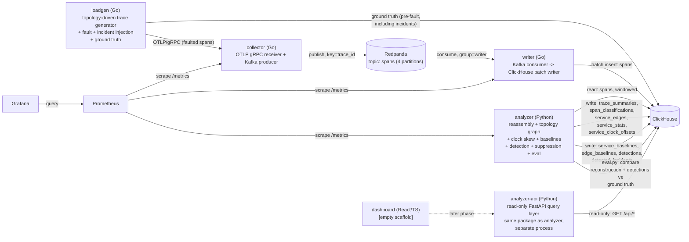

# Architecture

## Components (Phase 4, partial: query API only — dashboard not yet built)



Dotted edges are not implemented yet — only `dashboard` remains one, as an
empty scaffold; `api` (deliverable 1 of Phase 4) is built and live, just
not yet consumed by anything. `analyzer` does everything this project's
core measurement loop needs: trace reassembly, service topology
aggregation, clock skew detection, rolling baselines, anomaly detection,
alert suppression, and (`eval.py`) comparing its own reconstruction and
detections against loadgen's ground truth. `analyzer-api` is a second
process built from the same Python package and the same Docker image
(`analyzer/Dockerfile`, different entrypoint) — it shares `analyzer`'s
ClickHouse client and config code but no runtime state, and never writes
anything; see "Query API" below. `loadgen` writes ground truth straight
to ClickHouse, independent of (and prior to) whatever the OTLP/
fault-injected path actually delivers, and also schedules *incidents* —
real behavior changes in the simulated system, a deliberately separate
concept from fault injection — see "Ground truth" and "Incident
injection" below.

## Query API

`analyzer/src/analyzer/api/` — a read-only FastAPI layer over the
tables Phases 1-3 already populate. Nothing in this API detects,
reassembles, or writes anything; it exists because a browser can't query
ClickHouse directly. See docs/DECISIONS.md for why it's a separate
process sharing the `analyzer` package rather than a standalone service
or a thread inside the main analyzer loop.

- `routes.py` holds the one piece of genuinely new logic: every endpoint
  requires an explicit time range, capped server-side
  (`API_MAX_TIME_RANGE_SECONDS`), and every list endpoint's result count
  is capped server-side (`API_MAX_ROWS`) regardless of what a client
  requests — enforced before any query runs, not left to the `LIMIT`
  clause alone. This is what `tests/test_api_routes.py` actually tests,
  against a faked ClickHouse client.
- `queries.py` is the direct SQL, one function per endpoint's data need —
  read against a fake client in tests only incidentally (through the
  routes above); the SQL's real correctness was verified live against
  the running stack's actual data, the same way every other impure
  `_fetch_*`-shaped function in this project has been (reader.py,
  eval.py).
- `schemas.py` is the Pydantic wire format, deliberately a separate set
  of types from `queries.py`'s plain dataclasses — a ClickHouse column
  rename becomes a visible conversion-site change, not a silent
  wire-format break.
- Endpoints: `GET /api/traces` (paginated, filterable by service/
  completeness/minimum duration), `GET /api/traces/{trace_id}` (every
  span, each with its reassembly classification), `GET /api/topology`
  (service edges for a range: summed call/error counts, most-recent-window
  latency percentiles), `GET /api/detections` (grouped incidents for a
  range, derived/root-cause resolved where the root is in the same
  page), `GET /api/clock-offsets` (per-service offset + confidence,
  highest-confidence reading per service in range).

## Data flow — span lifecycle from emit to query

1. **Generate** — `loadgen` walks a YAML-defined service topology
   (`internal/topology`; ships with a default 6-service topology with one
   fan-out and one 4-level chain) to produce a trace: a root span and,
   recursively, downstream calls gated by each edge's call probability,
   each with a latency sampled from its service's configured distribution.
2. **Record ground truth** — before anything else happens to it, the
   pristine trace is written to `tracing.ground_truth_spans` (full
   trace/span/parent/service shape) and `tracing.ground_truth_edges` (one
   row per call, caller service -> callee service), tagged with a
   `run_id`. This is the answer key a later accuracy measurement compares
   reconstruction against — see `docs/DECISIONS.md` for why it's written
   directly rather than through the pipeline under test.
3. **Fault** — the pristine trace is run through whichever fault injectors
   are enabled (`internal/fault`): `--drop-rate` marks spans to never
   send; `--out-of-order-rate` delays a parent's emission past its
   children's; `--late-arrival-rate` delays a span's emission by minutes;
   `--clock-skew-rate` shifts a service's recorded `start_time`/`end_time`
   by a constant offset, decided once per service per run. Delay
   (out-of-order, late-arrival) is emission-time, not span content — a
   delayed span still claims its true original `start_time`/`end_time`,
   it just doesn't arrive at the collector until later, which is what
   makes it a legitimate late-arrival test case for the analyzer's
   watermark, not a corrupted span. Clock skew is the opposite: it *does*
   mutate the recorded timestamps (that's the point), while emission
   timing is untouched. Faults answer "did the *observability pipeline*
   corrupt an accurate picture of a healthy system" — a structurally
   different question from incidents, applied one step earlier — see
   "Incident injection" below.
4. **Emit** — spans due immediately are sent as one OTLP
   `ExportTraceServiceRequest`; each distinct delay value gets its own
   later `Export` call from its own goroutine, so a multi-minute
   late-arrival delay doesn't block the generation loop from continuing to
   emit new traces at the configured rate.
5. **Receive / publish** — `collector` validates each span, denormalizes
   `service.name` from Resource onto the span's own attributes, and
   publishes it to the `spans` Kafka topic keyed by `trace_id`.
6. **Consume + write** — `writer` batches and inserts into
   `tracing.spans`, committing Kafka offsets only after a successful
   insert. (Unchanged from Phase 1 — see that phase's section below for
   the backpressure behavior.)
7. **Reassemble, aggregate, and detect** — for each due window, `analyzer`
   fetches that window's spans once and runs several passes over the same
   rows: trace reassembly (-> `trace_summaries`, `span_classifications`;
   see "Trace reassembly" below), service topology aggregation (->
   `service_edges`; see "Service topology graph" below), per-service
   aggregation (-> `service_stats`), and clock skew detection (->
   `service_clock_offsets`; see "Clock skew detection" below). All of
   these share one helper, `reassembly.resolved_parent_child_pairs`, for
   "which (parent, child) pairs actually resolve in this window" — see
   `docs/DECISIONS.md`.
8. **Baseline, detect, and suppress** — still within the same window
   cycle: `baseline.py` recomputes each service's and edge's rolling
   median/MAD latency, error rate, and call-rate history from a trailing
   lookback (-> `service_baselines`, `edge_baselines`), `detectors.py`
   compares the current window against those baselines (-> `detections`),
   and `suppression.py` regroups the trailing lookback's detections into
   incidents and identifies which are likely just an upstream echo of a
   deeper one (-> `detected_incidents`). See "Baseline modeling and
   anomaly detection" and "Alert suppression" below.
9. **Evaluate** — `analyzer/src/analyzer/eval.py`, run manually
   (`python -m analyzer.eval <run_id>`) or by `scripts/run_sweep.sh` /
   `scripts/run_incident_sweep.sh`, compares the reconstruction and
   detections above against a specific run's ground truth: edge
   precision/recall/F1, span attachment accuracy, orphan classification
   accuracy, clock offset error, and (Phase 3) incident detection
   precision/recall/F1, detection latency, root-cause accuracy, and
   healthy-control false-positive rate. See "Accuracy evaluation" below.
10. **Self-monitoring** — `prometheus` scrapes `analyzer`
    (`analyzer_traces_processed_total`, `analyzer_orphan_spans_total`,
    `analyzer_late_spans_total`, `analyzer_incomplete_traces_total`,
    `analyzer_clock_violations_total`, `analyzer_detections_total`,
    `analyzer_baselines_cold_total`, `analyzer_incidents_open`,
    `analyzer_detections_suppressed_total`,
    `analyzer_window_processing_duration_seconds`); `grafana` has
    Prometheus wired in as a datasource, with no dashboards built yet.

## Trace reassembly: windowing, watermark, and classification

Full reasoning is in `analyzer/src/analyzer/windowing.py` and
`reassembly.py`'s module docstrings; this is the summary.

**Windows are epoch-aligned**, not aligned to when the analyzer started or
to calendar days: window *N* is `[N * window_seconds, (N+1) * window_seconds)`
in Unix time. A window becomes "due" once wall-clock time passes its end
plus the watermark delay. Because the default window size (60s) divides
evenly into a day, a window can never actually straddle midnight — that
boundary always falls exactly on a window edge. What *can* straddle a
ClickHouse partition boundary is the SQL query itself, if it's written as
`toDate(start_time) = X` instead of a `start_time` range; the analyzer's
window query is always a range for exactly this reason, and it has a
dedicated test (`tests_integration/test_partition_straddle.py`) against a
real ClickHouse to prove it.

**Late spans are never silently dropped.** A span that lands after its
window was already finalized is detected on a rolling basis (comparing
each span's ClickHouse `ingested_at` against a rolling cursor and the
oldest still-open window's boundary) and counted in
`analyzer_late_spans_total` — it just doesn't retroactively reopen and
re-emit a `trace_summaries` row for a window already marked processed.

**Every span in a window ends up classified as exactly one of:**
`ok` (reachable from a true root via parent/child links), the depths of the
tree, `orphan_missing_parent` (its `parent_span_id` doesn't resolve to any
span in the window), or `cycle_rejected` (its parent link resolves, but
that chain never bottoms out at a true root or an orphan — the only way
that can happen without a genuine cycle). Reachability is seeded from both
true roots *and* orphans, so a well-formed subtree hanging off a dropped
parent is `ok`, not `cycle_rejected` — see `docs/DECISIONS.md`.

## Service topology graph

`topology_agg.py` rolls resolved parent/child span pairs up into
service-level edges — one row per `(caller_service, callee_service)` pair
per window in `service_edges`, with call count, error count, and p50/p95/p99
latency. This is a flat group-by over pairs the reassembly pass already
resolved, not a graph traversal, so the self-call case (a service calling
itself) needs no special handling: there's no adjacency structure here
that could loop on it, and `test_aggregate_edges_self_call` proves it.

## Clock skew detection

`clockskew.py` looks for parent/child pairs where causality is physically
violated — a child recorded as starting before its parent, or outliving
it — and estimates a per-service clock offset from the aggregate of those
violations, never by correcting an individual span's stored timestamps
(`docs/DECISIONS.md`'s orphan-retention row applies the same principle
here: the stored data stays exactly what was received).

Only *relative* skew is recoverable from this kind of data — nothing says
which service (if any) has the correct clock, only that pairs disagree
and by how much. Estimates are anchored to a root service (offset defined
as exactly zero), and loadgen's `ClockSkewInjector` never skews the root
for the same reason. The baseline used to convert a raw timing gap into
an offset estimate is whichever topology edge's typical gap has the
smallest absolute value — not, as first implemented, the median of all
edges' typical gaps, which turned out to break badly when a single
*hub* service (touching most of the graph's edges) was skewed. Full
reasoning, including the real numbers this looked like before the fix,
and the fix's own remaining limitation, are in `clockskew.py`'s module
docstring, `docs/DECISIONS.md`, and `docs/ISSUES.md`.

## Incident injection

Distinct from fault injection (above) at a conceptual level that matters:
a fault corrupts how spans about a *healthy* system get delivered
(dropped, reordered, delayed, skewed); an incident changes what the
simulated system *actually did* — a service really was slower, really did
return errors, a downstream call really did stop happening. Ground truth
for the two lives in separate tables (`ground_truth_incidents` vs.
`ground_truth_edges`/`ground_truth_spans`/`ground_truth_clock_offsets`),
and the two compose freely — the same run can have both a fault rate and
an incident active, independently.

`topology.IncidentSpec` (`loadgen/internal/topology/incident.go`)
schedules one incident — a type, a target (service or edge), a start
offset and duration relative to run start, and a magnitude whose meaning
depends on type — and is applied *during* generation
(`generateSubtree`), not as a post-hoc transform the way faults are:

- **`latency_spike`** multiplies a service's configured mean latency
  before sampling.
- **`latency_tail`** independently inflates a fixed 5% of that service's
  calls by the magnitude, leaving the median untouched by construction —
  see `docs/DECISIONS.md` for why that fraction is fixed, not
  configurable.
- **`error_burst`** sets a fraction of a service's calls to `ERROR`
  status.
- **`throughput_drop`** multiplies an edge's call probability down by
  `(1 - magnitude)`.
- **`edge_disappearance`** forces an edge's call probability to exactly
  0, regardless of any simultaneously-active `throughput_drop` on the
  same edge.

A single ad hoc incident can be injected via CLI flags
(`--incident-type`/`--incident-target-*`/`--incident-magnitude`/
`--incident-start`/`--incident-duration`), mirroring the fault flags; or
several (potentially overlapping) incidents can be declared in a topology
YAML's `incidents:` list. Resolved (absolute-time) ground truth is
written to `ground_truth_incidents` once generation finishes.

**Known, measured limitation:** detection (below) runs against a span's
*total* duration, which for a non-leaf service already includes its
children's — diluting a `latency_spike`/`latency_tail` incident's effect
on a service whose recorded duration is mostly downstream calls, not its
own processing time. Not fixed — see `docs/DECISIONS.md`'s self-time
limitation entry and `docs/BENCHMARKS.md`'s depth breakdown for exactly
how much.

## Baseline modeling and anomaly detection

`baseline.py` maintains a rolling per-service and per-edge baseline —
median/MAD latency (robust to latency's right skew, unlike mean/stddev —
see `docs/DECISIONS.md`), error rate, and call-rate history — recomputed
every window from a trailing lookback (`ANALYZER_BASELINE_LOOKBACK_SECONDS`,
default 900s) that always ends at the *start* of the window being judged,
never including that window's own data. A target's baseline is marked not
`ready` below a minimum sample count (`ANALYZER_BASELINE_MIN_SAMPLES`,
default 30) rather than returned as a noisy estimate. Nothing here is
carried in process memory between windows — every baseline is recomputed
fresh from durable ClickHouse data, which is what actually makes it
survive a restart (the persisted `service_baselines`/`edge_baselines`
rows exist for observability, not because anything reads them back).

`detectors.py` runs three independent, individually-callable detectors
against each window's stats:

- **`detect_percentile_deviation`** — a robust z-score on the window's
  p95/p99 latency against the baseline's median/MAD, firing on whichever
  percentile deviates more.
- **`detect_error_rate_change`** — a pooled two-proportion z-test between
  the window's error rate and the baseline's, guarded by a minimum sample
  size.
- **`detect_call_rate_drop`** — a robust z-score on the window's call
  count against the baseline's per-window call-count history (falling
  back to a plain ratio check when that history has zero spread), with a
  target absent from the current window read as a real zero rather than
  missing data — see `docs/DECISIONS.md`.

Every firing detection is written to `detections`, one row per
`(target, detector, window)` — raw and unsuppressed.

## Alert suppression

`suppression.py` turns raw per-window detections into something usable in
two pure, independently-tested stages, run every window over a shorter
trailing lookback (`ANALYZER_GROUPING_LOOKBACK_SECONDS`, default 300s):

- **`group_detections`** collapses an exact back-to-back run of
  detections on the same `(target, detector)` into one incident with a
  start, end, and peak severity — turning "a 5-minute incident fires 10
  times at a 30s window" into one row.
- **`suppress_propagated`** walks each service-level incident downstream
  through the observed `service_edges` topology and, if a same-detector,
  time-overlapping incident exists further down, marks everything
  upstream of the *deepest* such target `derived` — pointing at the true
  root's incident, not just the immediate neighbor. Edge-level incidents
  are attributed the same way, via their callee, resolved all the way
  through rather than stopping at the callee's own (possibly also
  derived) incident.

Results land in `detected_incidents`, recomputed fresh from the lookback
every window the same way baselines are (see `docs/DECISIONS.md`) —
`detections` itself is never rewritten or pruned by this step.

## Accuracy evaluation

`eval.py` is deliberately split into a ClickHouse-querying half
(`evaluate`) and pure-Python metrics halves (`compute_metrics`,
`compute_incident_metrics`) that take plain data structures and have no
database dependency — the arithmetic is the part worth being confident
about, so it's unit-tested against hand-built data independent of any
live run. For a given `run_id` it reports:

- **Edge precision/recall/F1** — `service_edges` vs. `ground_truth_edges`,
  correlated to the run by a time range (`service_edges` isn't
  `run_id`-scoped — see "Ground truth" below) rather than a direct key.
- **Span attachment accuracy** — of ground-truth spans whose true parent
  also landed, what fraction the analyzer classified `ok`.
- **Orphan classification accuracy** — of landed spans whose true parent
  was dropped, what fraction were classified `orphan_missing_parent`.
- **Clock offset error** — detected minus true, per service, for services
  present in both.
- **Incident precision/recall/F1** — a true incident counts as detected
  if an analyzer incident on the mapped detector and matching target
  overlaps its true window; precision's denominator counts only
  *non-derived* analyzer incidents, so a correctly-suppressed propagated
  echo doesn't get counted against it (found live to matter a great
  deal — see `docs/ISSUES.md`).
- **Detection latency** — first matching analyzer incident's start window
  minus the true incident's start time.
- **Root-cause accuracy** — of derived incidents whose window overlaps a
  true incident, what fraction have a `root_cause_incident_id` that
  resolves to that true incident's actual target.
- **Observed magnitude** — a type-specific ratio (peak p99 ÷ baseline
  median for latency types; observed error rate directly; `1 - observed
  call rate ÷ baseline call rate` for throughput types) comparable to the
  injected magnitude, specifically so the self-time dilution effect shows
  up as a direct, readable number.
- **Healthy-control false-positive rate** — total raw detections in a run
  with zero true incidents, per hour.

Denominators of zero (e.g. orphan accuracy on a run with no drop fault,
or recall on a healthy-control run with no true incidents) report
`None`/"N/A", not a fabricated `0.0` or `1.0` — see `docs/DECISIONS.md`.

`scripts/run_sweep.sh` drives `eval.py` across the Phase 2 fault sweep:
each fault type independently, at 0/1/5/10/25%. `scripts/run_incident_sweep.sh`
drives it across the Phase 3 incident sweep: `latency_spike`/`latency_tail`
at 3 magnitudes on two service depths each, `error_burst`/`throughput_drop`/
`edge_disappearance` at 3 magnitudes on one representative target each,
plus a shared healthy control — each point **one continuous loadgen
process** with the incident scheduled mid-run via `--incident-start`, not
a sequence of short discrete processes (see `docs/DECISIONS.md` for why
that distinction matters specifically for this sweep's healthy-control
number). `docs/BENCHMARKS.md` has the actual measured tables.

## Ground truth

`loadgen` is the only thing in this system besides `writer` that talks to
ClickHouse directly, and it does so for one reason: ground truth has to
reflect what was *generated*, before any fault runs, which the
delivery-path spans in `tracing.spans` structurally cannot (that table
only ever contains what actually survived — or didn't). Every span's
`trace_id` is the join key between `ground_truth_spans` and `tracing.spans`;
`run_id` for a given trace is recovered by joining through
`ground_truth_spans` rather than adding a run-scoped column to the
production spans table. `ground_truth_clock_offsets` (one row per
service, once `ClockSkewInjector`'s offsets are finalized at the end of a
run) and `ground_truth_incidents` (one row per scheduled incident,
resolved to absolute wall-clock time once generation finishes) follow the
same `run_id`-scoped pattern.

Several of the analyzer's own output tables — `service_edges`,
`service_stats`, `service_clock_offsets`, `service_baselines`,
`edge_baselines`, `detections`, `detected_incidents` — are *not*
`run_id`-scoped, the same as `trace_summaries`/`span_classifications`
aren't (production tables don't carry a test-harness-only concept — see
`docs/DECISIONS.md`'s Phase 1 row on why `tracing.spans` itself has no
`run_id` column). `eval.py` correlates them to a specific run by time
range instead: the run's own `[min, max] ground_truth_spans.generated_at`,
widened by a small margin.

## Backpressure: what happens when ClickHouse is slow or down

(Unchanged from Phase 1 — this is the writer's behavior, not touched this
phase.)

The writer's Kafka-fetch/decode step and its batch/flush step are two
goroutines connected by a small, fixed-capacity queue
(`internal/boundedqueue`). When a ClickHouse insert fails, the flush step
retries with exponential backoff *without draining that queue* — so the
queue fills, which blocks the fetch step's next push, which leaves
unconsumed records sitting at the broker. The visible effect is: consumer
lag rises, the writer's memory usage does not, and the batch being retried
is neither discarded nor grown — it's retried as-is until it succeeds or
the writer shuts down. Offsets are committed only on that eventual success,
so nothing is acknowledged to Kafka that wasn't durably written. When
ClickHouse comes back, the same loop drains the backlog and lag returns to
zero — no manual intervention, no lost spans, no OOM. I verified this
directly (stopping and restarting the `clickhouse` container mid-run,
watching lag and memory) — see `docs/BENCHMARKS.md` for the measured
numbers and `integration/pipeline_test.go`'s
`TestClickHouseOutageBackpressureAndRecovery` for the automated version.

## Repo layout

```
/collector          Go — OTLP gRPC receiver + Kafka producer
/writer              Go — Kafka consumer -> ClickHouse batch writer
/loadgen             Go — topology-driven trace generator, fault + incident injection, ground truth writer
/analyzer            Python — reassembly, topology graph, clock skew, baselines,
                       anomaly detection, alert suppression, accuracy eval (eval.py),
                       read-only query API (api/, runs as its own container)
/integration         Go — compose-based integration tests (build tag: integration)
/scripts             run_sweep.sh (Phase 2 fault sweep), run_incident_sweep.sh (Phase 3 incident sweep)
/dashboard           React/TS (empty scaffold)
/deploy              docker-compose.yml (+ docker-compose.eval.yml overlay), ClickHouse init SQL, Prometheus/Grafana config
/docs                this file, DECISIONS.md, ISSUES.md, BENCHMARKS.md
```

## Running locally

```sh
cd deploy
docker compose up --build
```

Brings up Redpanda (plus a one-shot job that creates the 4-partition
`spans` topic), ClickHouse, collector, writer, analyzer, analyzer-api,
Prometheus, and Grafana. Grafana is at `http://localhost:3000`
(anonymous viewer access enabled for local dev) with Prometheus already
wired in as a datasource. Prometheus targets page is at
`http://localhost:9090/targets`. The query API is at
`http://localhost:8000` — e.g.
`curl 'http://localhost:8000/api/topology?start=2026-01-01T00:00:00Z&end=2026-01-01T01:00:00Z'`
(every endpoint requires `start`/`end`; see "Query API" above).

```sh
cd loadgen
go run ./cmd/loadgen --target localhost:4317 --clickhouse-addr localhost:9000 \
  --clickhouse-password tracing-dev --rate 5 --duration 30s
```

Sends synthetic traces to the collector using the built-in default
topology, and records ground truth for them. To exercise a fault:

```sh
go run ./cmd/loadgen --target localhost:4317 --clickhouse-addr localhost:9000 \
  --clickhouse-password tracing-dev --rate 5 --duration 30s --drop-rate 0.1
```

Query ClickHouse directly to see spans, ground truth, and (once a window's
watermark has passed) reassembly output land:

```sh
docker exec -it deploy-clickhouse-1 clickhouse-client --password tracing-dev \
  --query "SELECT count() FROM tracing.spans"
docker exec -it deploy-clickhouse-1 clickhouse-client --password tracing-dev \
  --query "SELECT * FROM tracing.trace_summaries ORDER BY processed_at DESC LIMIT 10"
```

```sh
cd integration
go test -tags=integration -timeout=10m ./...
```

Runs the full pipeline against a real (throwaway) compose stack. Requires
a `docker` CLI with the compose plugin; not part of the default CI matrix
(see `docs/DECISIONS.md`).

```sh
cd analyzer
python -m pytest                       # fast unit tests — in CI
python -m pytest tests_integration -v  # needs a running ClickHouse — not in CI
```

Once a run's ground truth exists and the relevant window has been
processed (watermark passed):

```sh
python -m analyzer.eval <run_id>          # human summary
python -m analyzer.eval <run_id> --json   # machine-readable
```

To inject an incident ad hoc:

```sh
go run ./cmd/loadgen --target localhost:4317 --clickhouse-addr localhost:9000 \
  --clickhouse-password tracing-dev --rate 20 --duration 120s \
  --incident-type latency_spike --incident-target-service checkout \
  --incident-magnitude 5 --incident-start 30s --incident-duration 60s
```

To run the full fault sweep or the full incident sweep (both need the
compose stack up with the eval overlay applied first — shrinks
window/watermark so a sweep of many points is tractable; see
`docs/DECISIONS.md` and `docs/ISSUES.md` for why the overlay's specific
values were chosen):

```sh
cd deploy && docker compose -f docker-compose.yml -f docker-compose.eval.yml up -d --build
cd .. && bash scripts/run_sweep.sh            # Phase 2: fault sweep -> scripts/sweep_results.jsonl
cd .. && bash scripts/run_incident_sweep.sh   # Phase 3: incident sweep -> scripts/incident_sweep_results.jsonl
```

`run_incident_sweep.sh` runs one continuous loadgen process per sweep
point with the incident scheduled mid-run, not a sequence of short
discrete processes — see `docs/DECISIONS.md` for why that's load-bearing
for this sweep's healthy-control false-positive number specifically.
