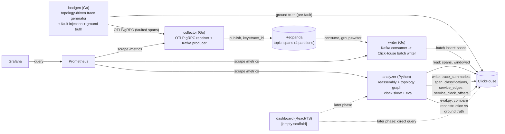

# Architecture

## Components (Phase 2)



Dotted edges are not implemented yet — only `dashboard` remains one, as an
empty scaffold. `analyzer` now does everything this project's core
measurement loop needs: trace reassembly, service topology aggregation,
clock skew detection, and (`eval.py`) comparing its own reconstruction
against loadgen's ground truth. `loadgen` writes ground truth straight to
ClickHouse, independent of (and prior to) whatever the OTLP/fault-injected
path actually delivers — see "Ground truth" below.

## Data flow — span lifecycle from emit to query

1. **Generate** — `loadgen` walks a YAML-defined service topology
   (`internal/topology`; ships with a default 6-service topology with one
   fan-out and one 4-level chain) to produce a trace: a root span and,
   recursively, downstream calls gated by each edge's call probability,
   each with a latency sampled from its service's configured distribution.
2. **Record ground truth** — before anything else happens to it, the
   pristine trace is written to `tracing.ground_truth_spans` (full
   trace/span/parent/service shape) and `tracing.ground_truth_edges` (one
   row per call, caller service -> callee service), tagged with a
   `run_id`. This is the answer key a later accuracy measurement compares
   reconstruction against — see `docs/DECISIONS.md` for why it's written
   directly rather than through the pipeline under test.
3. **Fault** — the pristine trace is run through whichever fault injectors
   are enabled (`internal/fault`): `--drop-rate` marks spans to never
   send; `--out-of-order-rate` delays a parent's emission past its
   children's; `--late-arrival-rate` delays a span's emission by minutes;
   `--clock-skew-rate` shifts a service's recorded `start_time`/`end_time`
   by a constant offset, decided once per service per run. Delay
   (out-of-order, late-arrival) is emission-time, not span content — a
   delayed span still claims its true original `start_time`/`end_time`,
   it just doesn't arrive at the collector until later, which is what
   makes it a legitimate late-arrival test case for the analyzer's
   watermark, not a corrupted span. Clock skew is the opposite: it *does*
   mutate the recorded timestamps (that's the point), while emission
   timing is untouched.
4. **Emit** — spans due immediately are sent as one OTLP
   `ExportTraceServiceRequest`; each distinct delay value gets its own
   later `Export` call from its own goroutine, so a multi-minute
   late-arrival delay doesn't block the generation loop from continuing to
   emit new traces at the configured rate.
5. **Receive / publish** — `collector` validates each span, denormalizes
   `service.name` from Resource onto the span's own attributes, and
   publishes it to the `spans` Kafka topic keyed by `trace_id`.
6. **Consume + write** — `writer` batches and inserts into
   `tracing.spans`, committing Kafka offsets only after a successful
   insert. (Unchanged from Phase 1 — see that phase's section below for
   the backpressure behavior.)
7. **Reassemble, aggregate, and detect** — for each due window, `analyzer`
   fetches that window's spans once and runs three independent passes over
   the same rows: trace reassembly (-> `trace_summaries`,
   `span_classifications`; see "Trace reassembly" below), service topology
   aggregation (-> `service_edges`; see "Service topology graph" below),
   and clock skew detection (-> `service_clock_offsets`; see "Clock skew
   detection" below). All three share one helper,
   `reassembly.resolved_parent_child_pairs`, for "which (parent, child)
   pairs actually resolve in this window" — see `docs/DECISIONS.md`.
8. **Evaluate** — `analyzer/src/analyzer/eval.py`, run manually
   (`python -m analyzer.eval <run_id>`) or by `scripts/run_sweep.sh`,
   compares the reconstruction above against a specific run's ground
   truth: edge precision/recall/F1, span attachment accuracy, orphan
   classification accuracy, and clock offset error. See "Accuracy
   evaluation" below.
9. **Self-monitoring** — `prometheus` scrapes `analyzer`
   (`analyzer_traces_processed_total`, `analyzer_orphan_spans_total`,
   `analyzer_late_spans_total`, `analyzer_incomplete_traces_total`,
   `analyzer_clock_violations_total`,
   `analyzer_window_processing_duration_seconds`); `grafana` has
   Prometheus wired in as a datasource, with no dashboards built yet.

## Trace reassembly: windowing, watermark, and classification

Full reasoning is in `analyzer/src/analyzer/windowing.py` and
`reassembly.py`'s module docstrings; this is the summary.

**Windows are epoch-aligned**, not aligned to when the analyzer started or
to calendar days: window *N* is `[N * window_seconds, (N+1) * window_seconds)`
in Unix time. A window becomes "due" once wall-clock time passes its end
plus the watermark delay. Because the default window size (60s) divides
evenly into a day, a window can never actually straddle midnight — that
boundary always falls exactly on a window edge. What *can* straddle a
ClickHouse partition boundary is the SQL query itself, if it's written as
`toDate(start_time) = X` instead of a `start_time` range; the analyzer's
window query is always a range for exactly this reason, and it has a
dedicated test (`tests_integration/test_partition_straddle.py`) against a
real ClickHouse to prove it.

**Late spans are never silently dropped.** A span that lands after its
window was already finalized is detected on a rolling basis (comparing
each span's ClickHouse `ingested_at` against a rolling cursor and the
oldest still-open window's boundary) and counted in
`analyzer_late_spans_total` — it just doesn't retroactively reopen and
re-emit a `trace_summaries` row for a window already marked processed.

**Every span in a window ends up classified as exactly one of:**
`ok` (reachable from a true root via parent/child links), the depths of the
tree, `orphan_missing_parent` (its `parent_span_id` doesn't resolve to any
span in the window), or `cycle_rejected` (its parent link resolves, but
that chain never bottoms out at a true root or an orphan — the only way
that can happen without a genuine cycle). Reachability is seeded from both
true roots *and* orphans, so a well-formed subtree hanging off a dropped
parent is `ok`, not `cycle_rejected` — see `docs/DECISIONS.md`.

## Service topology graph

`topology_agg.py` rolls resolved parent/child span pairs up into
service-level edges — one row per `(caller_service, callee_service)` pair
per window in `service_edges`, with call count, error count, and p50/p95/p99
latency. This is a flat group-by over pairs the reassembly pass already
resolved, not a graph traversal, so the self-call case (a service calling
itself) needs no special handling: there's no adjacency structure here
that could loop on it, and `test_aggregate_edges_self_call` proves it.

## Clock skew detection

`clockskew.py` looks for parent/child pairs where causality is physically
violated — a child recorded as starting before its parent, or outliving
it — and estimates a per-service clock offset from the aggregate of those
violations, never by correcting an individual span's stored timestamps
(`docs/DECISIONS.md`'s orphan-retention row applies the same principle
here: the stored data stays exactly what was received).

Only *relative* skew is recoverable from this kind of data — nothing says
which service (if any) has the correct clock, only that pairs disagree
and by how much. Estimates are anchored to a root service (offset defined
as exactly zero), and loadgen's `ClockSkewInjector` never skews the root
for the same reason. The baseline used to convert a raw timing gap into
an offset estimate is whichever topology edge's typical gap has the
smallest absolute value — not, as first implemented, the median of all
edges' typical gaps, which turned out to break badly when a single
*hub* service (touching most of the graph's edges) was skewed. Full
reasoning, including the real numbers this looked like before the fix,
and the fix's own remaining limitation, are in `clockskew.py`'s module
docstring, `docs/DECISIONS.md`, and `docs/ISSUES.md`.

## Accuracy evaluation

`eval.py` is deliberately split into a ClickHouse-querying half
(`evaluate`) and a pure-Python metrics half (`compute_metrics`) that takes
plain sets/dicts and has no database dependency — the arithmetic is the
part worth being confident about, so it's unit-tested against hand-built
data independent of any live run. For a given `run_id` it reports:

- **Edge precision/recall/F1** — `service_edges` vs. `ground_truth_edges`,
  correlated to the run by a time range (`service_edges` isn't
  `run_id`-scoped — see "Ground truth" below) rather than a direct key.
- **Span attachment accuracy** — of ground-truth spans whose true parent
  also landed, what fraction the analyzer classified `ok`.
- **Orphan classification accuracy** — of landed spans whose true parent
  was dropped, what fraction were classified `orphan_missing_parent`.
- **Clock offset error** — detected minus true, per service, for services
  present in both.

Denominators of zero (e.g. orphan accuracy on a run with no drop fault)
report `None`/"N/A", not a fabricated `0.0` or `1.0` — see
`docs/DECISIONS.md`.

`scripts/run_sweep.sh` drives `eval.py` across the full fault sweep: each
fault type independently, at 0/1/5/10/25%, writing one JSON line per
sweep point. `docs/BENCHMARKS.md` has the actual measured table.

## Ground truth

`loadgen` is the only thing in this system besides `writer` that talks to
ClickHouse directly, and it does so for one reason: ground truth has to
reflect what was *generated*, before any fault runs, which the
delivery-path spans in `tracing.spans` structurally cannot (that table
only ever contains what actually survived — or didn't). Every span's
`trace_id` is the join key between `ground_truth_spans` and `tracing.spans`;
`run_id` for a given trace is recovered by joining through
`ground_truth_spans` rather than adding a run-scoped column to the
production spans table. `ground_truth_clock_offsets` (one row per
service, once `ClockSkewInjector`'s offsets are finalized at the end of a
run) follows the same `run_id`-scoped pattern.

Two of the analyzer's own output tables — `service_edges` and
`service_clock_offsets` — are *not* `run_id`-scoped, the same as
`trace_summaries`/`span_classifications` aren't (production tables don't
carry a test-harness-only concept — see `docs/DECISIONS.md`'s Phase 1
row on why `tracing.spans` itself has no `run_id` column). `eval.py`
correlates them to a specific run by time range instead: the run's own
`[min, max] ground_truth_spans.generated_at`, widened by a small margin.

## Backpressure: what happens when ClickHouse is slow or down

(Unchanged from Phase 1 — this is the writer's behavior, not touched this
phase.)

The writer's Kafka-fetch/decode step and its batch/flush step are two
goroutines connected by a small, fixed-capacity queue
(`internal/boundedqueue`). When a ClickHouse insert fails, the flush step
retries with exponential backoff *without draining that queue* — so the
queue fills, which blocks the fetch step's next push, which leaves
unconsumed records sitting at the broker. The visible effect is: consumer
lag rises, the writer's memory usage does not, and the batch being retried
is neither discarded nor grown — it's retried as-is until it succeeds or
the writer shuts down. Offsets are committed only on that eventual success,
so nothing is acknowledged to Kafka that wasn't durably written. When
ClickHouse comes back, the same loop drains the backlog and lag returns to
zero — no manual intervention, no lost spans, no OOM. I verified this
directly (stopping and restarting the `clickhouse` container mid-run,
watching lag and memory) — see `docs/BENCHMARKS.md` for the measured
numbers and `integration/pipeline_test.go`'s
`TestClickHouseOutageBackpressureAndRecovery` for the automated version.

## Repo layout

```
/collector          Go — OTLP gRPC receiver + Kafka producer
/writer              Go — Kafka consumer -> ClickHouse batch writer
/loadgen             Go — topology-driven trace generator, fault injection, ground truth writer
/analyzer            Python — reassembly, service topology graph, clock skew, accuracy eval (eval.py)
/integration         Go — compose-based integration tests (build tag: integration)
/scripts             run_sweep.sh — the deliverable-5 fault sweep driver
/dashboard           React/TS (empty scaffold)
/deploy              docker-compose.yml (+ docker-compose.eval.yml overlay), ClickHouse init SQL, Prometheus/Grafana config
/docs                this file, DECISIONS.md, ISSUES.md, BENCHMARKS.md
```

## Running locally

```sh
cd deploy
docker compose up --build
```

Brings up Redpanda (plus a one-shot job that creates the 4-partition
`spans` topic), ClickHouse, collector, writer, analyzer, Prometheus, and
Grafana. Grafana is at `http://localhost:3000` (anonymous viewer access
enabled for local dev) with Prometheus already wired in as a datasource.
Prometheus targets page is at `http://localhost:9090/targets`.

```sh
cd loadgen
go run ./cmd/loadgen --target localhost:4317 --clickhouse-addr localhost:9000 \
  --clickhouse-password tracing-dev --rate 5 --duration 30s
```

Sends synthetic traces to the collector using the built-in default
topology, and records ground truth for them. To exercise a fault:

```sh
go run ./cmd/loadgen --target localhost:4317 --clickhouse-addr localhost:9000 \
  --clickhouse-password tracing-dev --rate 5 --duration 30s --drop-rate 0.1
```

Query ClickHouse directly to see spans, ground truth, and (once a window's
watermark has passed) reassembly output land:

```sh
docker exec -it deploy-clickhouse-1 clickhouse-client --password tracing-dev \
  --query "SELECT count() FROM tracing.spans"
docker exec -it deploy-clickhouse-1 clickhouse-client --password tracing-dev \
  --query "SELECT * FROM tracing.trace_summaries ORDER BY processed_at DESC LIMIT 10"
```

```sh
cd integration
go test -tags=integration -timeout=10m ./...
```

Runs the full pipeline against a real (throwaway) compose stack. Requires
a `docker` CLI with the compose plugin; not part of the default CI matrix
(see `docs/DECISIONS.md`).

```sh
cd analyzer
python -m pytest                       # fast unit tests — in CI
python -m pytest tests_integration -v  # needs a running ClickHouse — not in CI
```

Once a run's ground truth exists and the relevant window has been
processed (watermark passed):

```sh
python -m analyzer.eval <run_id>          # human summary
python -m analyzer.eval <run_id> --json   # machine-readable
```

To run the full fault sweep (needs the compose stack up with the eval
overlay applied first — shrinks window/watermark so 17 sweep points are
tractable; see `docs/DECISIONS.md` and `docs/ISSUES.md` for why the
overlay's specific values were chosen):

```sh
cd deploy && docker compose -f docker-compose.yml -f docker-compose.eval.yml up -d --build
cd .. && bash scripts/run_sweep.sh
```

Writes one JSON line per sweep point to `scripts/sweep_results.jsonl`.
