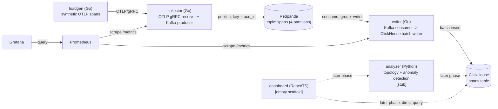

# Architecture

## Components (Phase 1)



Dotted edges are not implemented yet. Every edge in the Phase 0 diagram
that was dotted (collector→Redpanda→writer→ClickHouse) is now solid and
live; only `analyzer` and `dashboard` remain stubs, including the
dashboard's eventual direct-query path to ClickHouse for ad hoc trace
lookups (Phase 4+ — not planned to always go through `analyzer`).

## Data flow — span lifecycle from emit to query

1. **Emit** — `loadgen` builds a synthetic trace (3-5 spans, parent/child
   chain across `frontend`, `checkout`, `inventory`) and sends it as an OTLP
   `ExportTraceServiceRequest` over gRPC.
2. **Receive** — `collector` implements the OTLP `TraceService/Export` RPC.
   It validates each span (non-empty `trace_id`/`span_id`), denormalizes
   `service.name` from the request's `Resource` onto each span's own
   attributes (see `docs/DECISIONS.md`), and hands it to its Kafka
   producer. It exposes `/healthz` and `/metrics` on a separate HTTP port.
3. **Publish** — the producer publishes each span as an individual OTLP
   `Span` message (protobuf, no wrapper envelope) to the `spans` topic,
   keyed by raw `trace_id` bytes so every span of a trace lands on the same
   partition. Publishing is async and admission-controlled by a bounded
   in-flight limit (`KAFKA_MAX_IN_FLIGHT`, default 2000); a full buffer
   fails the `Export` call synchronously rather than dropping silently.
4. **Consume + write** — `writer` consumes from the `spans` topic as
   consumer group `writer`, decodes each message back into a row matching
   `deploy/clickhouse/init.sql`'s schema, and accumulates rows in a bounded
   in-memory batch. The batch flushes on 5000 rows or 2 seconds, whichever
   comes first, into a single ClickHouse batch insert. Kafka offsets are
   committed only after that insert succeeds — never before, never on a
   failed or retrying insert. See "Backpressure" below.
5. **Query** (later phases) — `analyzer` will read from ClickHouse to build
   a service topology graph and detect anomalies; `dashboard` will present
   traces and topology to a user, including some queries going straight to
   ClickHouse rather than through `analyzer`. Both remain unimplemented
   scaffolds as of Phase 1.
6. **Self-monitoring** — `prometheus` scrapes `collector` and `writer`
   `/metrics` (now including the Phase 1 pipeline metrics — publish/consume
   counts, batch sizes, flush duration, and consumer lag); `grafana` has
   Prometheus wired in as a datasource automatically, with no dashboards
   built yet (Phase 6).

## Backpressure: what happens when ClickHouse is slow or down

This is the behavior Phase 1 exists to get right, so it's worth spelling
out as its own section rather than leaving it implicit in the data-flow
list above.

The writer's Kafka-fetch/decode step and its batch/flush step are two
goroutines connected by a small, fixed-capacity queue
(`internal/boundedqueue`). When a ClickHouse insert fails, the flush step
retries with exponential backoff *without draining that queue* — so the
queue fills, which blocks the fetch step's next push, which leaves
unconsumed records sitting at the broker. The visible effect is: consumer
lag rises, the writer's memory usage does not, and the batch being retried
is neither discarded nor grown — it's retried as-is until it succeeds or
the writer shuts down. Offsets are committed only on that eventual success,
so nothing is acknowledged to Kafka that wasn't durably written. When
ClickHouse comes back, the same loop drains the backlog and lag returns to
zero — no manual intervention, no lost spans, no OOM. This was verified
directly (stopping and restarting the `clickhouse` container mid-run,
watching lag and memory) — see the Phase 1 report and
`integration/pipeline_test.go`'s `TestClickHouseOutageBackpressureAndRecovery`.

## Repo layout

```
/collector          Go — OTLP gRPC receiver + Kafka producer
/writer              Go — Kafka consumer -> ClickHouse batch writer
/loadgen             Go — synthetic span generator
/integration         Go — compose-based integration tests (build tag: integration)
/analyzer            Python — topology + anomaly detection (stub only)
/dashboard           React/TS (empty scaffold)
/deploy              docker-compose.yml, ClickHouse init SQL, Prometheus/Grafana config
/docs                this file, DECISIONS.md, ISSUES.md, BENCHMARKS.md
```

## Running locally

```sh
cd deploy
docker compose up --build
```

Brings up Redpanda (plus a one-shot job that creates the 4-partition
`spans` topic), ClickHouse, collector, writer, Prometheus, and Grafana.
Grafana is at `http://localhost:3000` (anonymous viewer access enabled for
local dev) with Prometheus already wired in as a datasource. Prometheus
targets page is at `http://localhost:9090/targets`.

```sh
cd loadgen
go run ./cmd/loadgen --target localhost:4317 --rate 5 --duration 30s
```

Sends synthetic traces to the collector; watch `collector`'s logs for
`received spans` entries, and query ClickHouse directly to see them land:

```sh
docker exec -it deploy-clickhouse-1 clickhouse-client --password tracing-dev \
  --query "SELECT count() FROM tracing.spans"
```

```sh
cd integration
go test -tags=integration -timeout=10m ./...
```

Runs the full pipeline against a real (throwaway) compose stack, including
the ClickHouse-outage recovery test. Requires a `docker` CLI with the
compose plugin; not part of the default CI matrix (see `docs/DECISIONS.md`).
