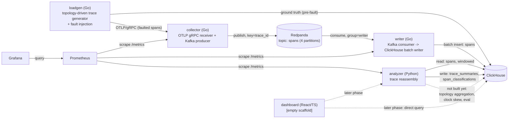

# Architecture

## Components (Phase 2, partial)



Dotted edges are not implemented yet. `analyzer` is real now — it reads
`spans` and writes `trace_summaries`/`span_classifications` — but only
does trace reassembly so far; topology aggregation (`service_edges`),
clock skew detection/correction, and the ground-truth accuracy eval
(`eval.py`) are separate, later pieces of the same service, not yet built.
`loadgen` gained a second outbound edge: it writes ground truth straight to
ClickHouse, independent of (and prior to) whatever the OTLP/fault-injected
path actually delivers — see "Ground truth" below.

## Data flow — span lifecycle from emit to query

1. **Generate** — `loadgen` walks a YAML-defined service topology
   (`internal/topology`; ships with a default 6-service topology with one
   fan-out and one 4-level chain) to produce a trace: a root span and,
   recursively, downstream calls gated by each edge's call probability,
   each with a latency sampled from its service's configured distribution.
2. **Record ground truth** — before anything else happens to it, the
   pristine trace is written to `tracing.ground_truth_spans` (full
   trace/span/parent/service shape) and `tracing.ground_truth_edges` (one
   row per call, caller service -> callee service), tagged with a
   `run_id`. This is the answer key a later accuracy measurement compares
   reconstruction against — see `docs/DECISIONS.md` for why it's written
   directly rather than through the pipeline under test.
3. **Fault** — the pristine trace is run through whichever fault injectors
   are enabled (`internal/fault`): `--drop-rate` marks spans to never
   send; `--out-of-order-rate` delays a parent's emission past its
   children's; `--late-arrival-rate` delays a span's emission by minutes.
   (`--clock-skew` is not implemented yet — see `docs/DECISIONS.md`.)
   Delay is emission-time, not span content — a delayed span still claims
   its true original `start_time`/`end_time`, it just doesn't arrive at
   the collector until later, which is what makes it a legitimate
   late-arrival test case for the analyzer's watermark, not a corrupted
   span.
4. **Emit** — spans due immediately are sent as one OTLP
   `ExportTraceServiceRequest`; each distinct delay value gets its own
   later `Export` call from its own goroutine, so a multi-minute
   late-arrival delay doesn't block the generation loop from continuing to
   emit new traces at the configured rate.
5. **Receive / publish** — `collector` validates each span, denormalizes
   `service.name` from Resource onto the span's own attributes, and
   publishes it to the `spans` Kafka topic keyed by `trace_id`.
6. **Consume + write** — `writer` batches and inserts into
   `tracing.spans`, committing Kafka offsets only after a successful
   insert. (Unchanged from Phase 1 — see that phase's section below for
   the backpressure behavior.)
7. **Reassemble** — `analyzer` polls `tracing.spans` in fixed-size,
   epoch-aligned windows (default 60s) with a watermark delay (default
   30s) before treating a window as closed, giving ordinarily-late spans
   time to land. For each window, every trace present gets grouped by
   `trace_id`, linked via `parent_span_id`, and classified — see
   "Trace reassembly" below. Results land in `tracing.trace_summaries`
   (one row per trace per window) and `tracing.span_classifications` (one
   row per span).
8. **Self-monitoring** — `prometheus` now also scrapes `analyzer`
   (`analyzer_traces_processed_total`, `analyzer_orphan_spans_total`,
   `analyzer_late_spans_total`, `analyzer_incomplete_traces_total`,
   `analyzer_window_processing_duration_seconds`); `grafana` has
   Prometheus wired in as a datasource, with no dashboards built yet.

## Trace reassembly: windowing, watermark, and classification

Full reasoning is in `analyzer/src/analyzer/windowing.py` and
`reassembly.py`'s module docstrings; this is the summary.

**Windows are epoch-aligned**, not aligned to when the analyzer started or
to calendar days: window *N* is `[N * window_seconds, (N+1) * window_seconds)`
in Unix time. A window becomes "due" once wall-clock time passes its end
plus the watermark delay. Because the default window size (60s) divides
evenly into a day, a window can never actually straddle midnight — that
boundary always falls exactly on a window edge. What *can* straddle a
ClickHouse partition boundary is the SQL query itself, if it's written as
`toDate(start_time) = X` instead of a `start_time` range; the analyzer's
window query is always a range for exactly this reason, and it has a
dedicated test (`tests_integration/test_partition_straddle.py`) against a
real ClickHouse to prove it.

**Late spans are never silently dropped.** A span that lands after its
window was already finalized is detected on a rolling basis (comparing
each span's ClickHouse `ingested_at` against a rolling cursor and the
oldest still-open window's boundary) and counted in
`analyzer_late_spans_total` — it just doesn't retroactively reopen and
re-emit a `trace_summaries` row for a window already marked processed.

**Every span in a window ends up classified as exactly one of:**
`ok` (reachable from a true root via parent/child links), the depths of the
tree, `orphan_missing_parent` (its `parent_span_id` doesn't resolve to any
span in the window), or `cycle_rejected` (its parent link resolves, but
that chain never bottoms out at a true root or an orphan — the only way
that can happen without a genuine cycle). Reachability is seeded from both
true roots *and* orphans, so a well-formed subtree hanging off a dropped
parent is `ok`, not `cycle_rejected` — see `docs/DECISIONS.md`.

## Ground truth

`loadgen` is now the only thing in this system besides `writer` that talks
to ClickHouse directly, and it does so for one reason: ground truth has to
reflect what was *generated*, before any fault runs, which the
delivery-path spans in `tracing.spans` structurally cannot (that table
only ever contains what actually survived — or didn't). Every span's
`trace_id` is the join key between `ground_truth_spans` and `tracing.spans`;
`run_id` for a given trace is recovered by joining through
`ground_truth_spans` rather than adding a run-scoped column to the
production spans table.

## Backpressure: what happens when ClickHouse is slow or down

(Unchanged from Phase 1 — this is the writer's behavior, not touched this
phase.)

The writer's Kafka-fetch/decode step and its batch/flush step are two
goroutines connected by a small, fixed-capacity queue
(`internal/boundedqueue`). When a ClickHouse insert fails, the flush step
retries with exponential backoff *without draining that queue* — so the
queue fills, which blocks the fetch step's next push, which leaves
unconsumed records sitting at the broker. The visible effect is: consumer
lag rises, the writer's memory usage does not, and the batch being retried
is neither discarded nor grown — it's retried as-is until it succeeds or
the writer shuts down. Offsets are committed only on that eventual success,
so nothing is acknowledged to Kafka that wasn't durably written. When
ClickHouse comes back, the same loop drains the backlog and lag returns to
zero — no manual intervention, no lost spans, no OOM. I verified this
directly (stopping and restarting the `clickhouse` container mid-run,
watching lag and memory) — see `docs/BENCHMARKS.md` for the measured
numbers and `integration/pipeline_test.go`'s
`TestClickHouseOutageBackpressureAndRecovery` for the automated version.

## Repo layout

```
/collector          Go — OTLP gRPC receiver + Kafka producer
/writer              Go — Kafka consumer -> ClickHouse batch writer
/loadgen             Go — topology-driven trace generator, fault injection, ground truth writer
/analyzer            Python — trace reassembly (topology aggregation, clock skew, eval: not yet built)
/integration         Go — compose-based integration tests (build tag: integration)
/dashboard           React/TS (empty scaffold)
/deploy              docker-compose.yml, ClickHouse init SQL, Prometheus/Grafana config
/docs                this file, DECISIONS.md, ISSUES.md, BENCHMARKS.md
```

## Running locally

```sh
cd deploy
docker compose up --build
```

Brings up Redpanda (plus a one-shot job that creates the 4-partition
`spans` topic), ClickHouse, collector, writer, analyzer, Prometheus, and
Grafana. Grafana is at `http://localhost:3000` (anonymous viewer access
enabled for local dev) with Prometheus already wired in as a datasource.
Prometheus targets page is at `http://localhost:9090/targets`.

```sh
cd loadgen
go run ./cmd/loadgen --target localhost:4317 --clickhouse-addr localhost:9000 \
  --clickhouse-password tracing-dev --rate 5 --duration 30s
```

Sends synthetic traces to the collector using the built-in default
topology, and records ground truth for them. To exercise a fault:

```sh
go run ./cmd/loadgen --target localhost:4317 --clickhouse-addr localhost:9000 \
  --clickhouse-password tracing-dev --rate 5 --duration 30s --drop-rate 0.1
```

Query ClickHouse directly to see spans, ground truth, and (once a window's
watermark has passed) reassembly output land:

```sh
docker exec -it deploy-clickhouse-1 clickhouse-client --password tracing-dev \
  --query "SELECT count() FROM tracing.spans"
docker exec -it deploy-clickhouse-1 clickhouse-client --password tracing-dev \
  --query "SELECT * FROM tracing.trace_summaries ORDER BY processed_at DESC LIMIT 10"
```

```sh
cd integration
go test -tags=integration -timeout=10m ./...
```

Runs the full pipeline against a real (throwaway) compose stack. Requires
a `docker` CLI with the compose plugin; not part of the default CI matrix
(see `docs/DECISIONS.md`).

```sh
cd analyzer
python -m pytest                       # fast unit tests — in CI
python -m pytest tests_integration -v  # needs a running ClickHouse — not in CI
```
