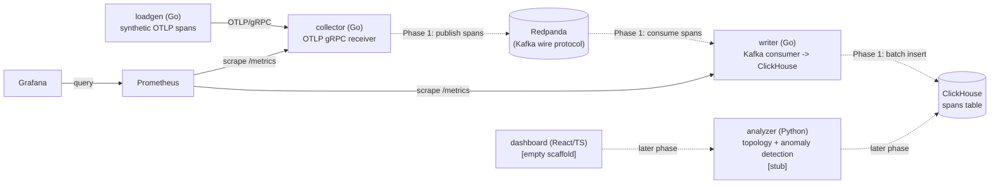

# Architecture

## Components (Phase 0)



Dotted edges are not implemented yet — they're the Phase 1+ data path,
included here so the skeleton's shape is legible even though the wiring
doesn't exist yet. Solid edges are live in Phase 0.

## Data flow — span lifecycle from emit to query

1. **Emit** — `loadgen` builds a synthetic trace (3-5 spans, parent/child
   chain across `frontend`, `checkout`, `inventory`) and sends it as an OTLP
   `ExportTraceServiceRequest` over gRPC.
2. **Receive** — `collector` implements the OTLP `TraceService/Export` RPC.
   In Phase 0 it validates the request, counts spans, logs the count, and
   discards the data. It exposes `/healthz` and `/metrics` on a separate
   HTTP port.
3. **Publish** (Phase 1) — `collector` will publish received spans to a
   Redpanda topic instead of discarding them.
4. **Consume + write** (Phase 1) — `writer` will consume from Redpanda and
   batch-insert into ClickHouse's `spans` table. In Phase 0 it only proves
   it can connect to both Redpanda and ClickHouse at startup, failing fast
   if either is unreachable.
5. **Query** (later phases) — `analyzer` reads from ClickHouse to build a
   service topology graph and detect anomalies; `dashboard` presents traces
   and topology to a user. Both are unimplemented scaffolds in Phase 0.
6. **Self-monitoring** — `prometheus` scrapes `collector` and `writer`
   `/metrics` endpoints (default Go runtime metrics only, in Phase 0);
   `grafana` is provisioned with Prometheus as a datasource automatically,
   with no dashboards yet.

## Why nothing here talks to Kafka or ClickHouse yet

Phase 0 exists to prove the skeleton — service boundaries, config
conventions, health/metrics conventions, graceful shutdown, and
`docker compose up` reaching a healthy state — before any data actually
flows end to end. `collector` discards what it receives; `writer` proves
connectivity and does nothing else. This keeps the surface area reviewable
and means later phases (Kafka publish/consume, ClickHouse writes) are
additive rather than requiring a rewrite of the skeleton.

## Repo layout

```
/collector          Go — OTLP gRPC receiver
/writer              Go — Kafka consumer -> ClickHouse batch writer
/loadgen             Go — synthetic span generator
/analyzer            Python — topology + anomaly detection (stub only, Phase 0)
/dashboard           React/TS (empty scaffold, Phase 0)
/deploy              docker-compose.yml, ClickHouse init SQL, Prometheus/Grafana config
/docs                this file, DECISIONS.md, BENCHMARKS.md
```

## Running locally

```sh
cd deploy
docker compose up --build
```

Brings up Redpanda, ClickHouse, collector, writer, Prometheus, and Grafana.
Grafana is at `http://localhost:3000` (anonymous viewer access enabled for
local dev) with Prometheus already wired in as a datasource. Prometheus
targets page is at `http://localhost:9090/targets`.

```sh
cd loadgen
go run ./cmd/loadgen --target localhost:4317 --rate 5 --duration 30s
```

Sends synthetic traces to the collector; watch `collector`'s logs for
`received spans` entries.
